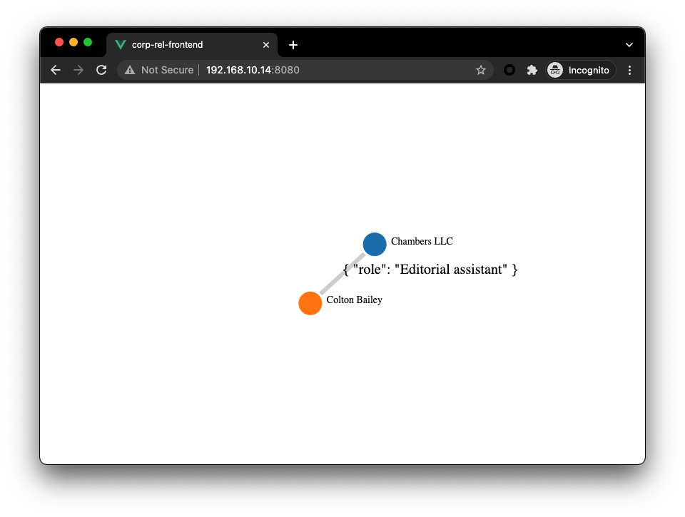

`Corp-Rel` is a PoC of Corpartion Relationship Knowledge Graph System. It's built on top of the Open Source Graph Database: Nebula Graph with a dataset from [nebula-shareholding-example](https://github.com/wey-gu/nebula-shareholding-example).

https://user-images.githubusercontent.com/1651790/137133913-f9f08ab0-d9bb-4735-9106-acd9a51e43eb.mov


## Quick Start

First, please setup a Nebula Graph Cluster with data loaded from [nebula-shareholding-example](https://github.com/wey-gu/nebula-shareholding-example).

Then, clone this project:

```bash
git clone https://github.com/wey-gu/nebula-corp-rel-search.git
cd nebula-corp-rel-search
```

Start the backend:

```bash
python3 -m pip install -r requirements.txt
cd corp-rel-backend
export NG_ENDPOINTS="192.168.123.456:9669" # This should be your Nebula Graph Cluster GraphD Endpoint
python3 app.py
```

Start the frontend in another terminal:

```bash
npm install -g @vue/cli
cd nebula-corp-rel-search/corp-rel-frontend
vue serve src/main.js
```

Start a reverse Proxy to enable `Corp-Rel` Backend being served with same origin of Frontend:

For example below is a Nginx config to make `:8081/` go to `http://localhost:8080` and `:8081/api` go to `http://192.168.123.456:5000/api`.

```nginx
http {
    include       mime.types;
    default_type  application/octet-stream;

    keepalive_timeout  65;

    server {
        listen       8081;
        server_name  localhost;
        # frontend
        location / {
            proxy_pass http://localhost:8080;
        }
        # backend
        location /api {
            proxy_pass http://192.168.123.456:5000/api;
        }
    }
#...
```

After above reverse proxy being configured, let's verify it via cURL:

```bash
curl --header "Content-Type: application/json" \
     --request POST \
     --data '{"entity": "c_132"}' \
     http://localhost:8081/api | jq
```

If it's properly responded, hen we could go to http://localhost:8081 from the web browser :).


## Design Log

### data from Backend Side

Backend should query node's relationship path as follow:

```cypher
MATCH p=(v)-[e:hold_share|:is_branch_of|:reletive_with|:role_as*1..3]-(v2) \
WHERE id(v) IN ["c_132"] RETURN p LIMIT 100
```

An example of the query will be like this:

```cypher
(root@nebula) [shareholding]> MATCH p=(v)-[e:hold_share|:is_branch_of|:reletive_with|:role_as*1..3]-(v2) \
                           -> WHERE id(v) IN ["c_132"] RETURN p LIMIT 100
+------------------------------------------------------------------------------------------------------------------------------------------------------------------------------------------------------------------------------------------+
| p                                                                                                                                                                                                                                        |
+------------------------------------------------------------------------------------------------------------------------------------------------------------------------------------------------------------------------------------------+
| <("c_132" :corp{name: "Chambers LLC"})<-[:hold_share@0 {share: 0.0}]-("c_245" :corp{name: "Thompson-King"})>                                                                                                                             |
+------------------------------------------------------------------------------------------------------------------------------------------------------------------------------------------------------------------------------------------+
| <("c_132" :corp{name: "Chambers LLC"})<-[:hold_share@0 {share: 3.0}]-("p_1039" :person{name: "Christian Miller"})>                                                                                                                       |
+------------------------------------------------------------------------------------------------------------------------------------------------------------------------------------------------------------------------------------------+
| <("c_132" :corp{name: "Chambers LLC"})<-[:hold_share@0 {share: 3.0}]-("p_1399" :person{name: "Sharon Gonzalez"})>                                                                                                                        |
+------------------------------------------------------------------------------------------------------------------------------------------------------------------------------------------------------------------------------------------+
| <("c_132" :corp{name: "Chambers LLC"})<-[:hold_share@0 {share: 9.0}]-("p_1767" :person{name: "Dr. David Vance"})>                                                                                                                        |
+------------------------------------------------------------------------------------------------------------------------------------------------------------------------------------------------------------------------------------------+
| <("c_132" :corp{name: "Chambers LLC"})<-[:hold_share@0 {share: 11.0}]-("p_1997" :person{name: "Glenn Reed"})>                                                                                                                            |
+------------------------------------------------------------------------------------------------------------------------------------------------------------------------------------------------------------------------------------------+
| <("c_132" :corp{name: "Chambers LLC"})<-[:hold_share@0 {share: 14.0}]-("p_2341" :person{name: "Jessica Baker"})>                                                                                                                         |
+------------------------------------------------------------------------------------------------------------------------------------------------------------------------------------------------------------------------------------------+
...
```

Leveraging `nebula2-python`, we could have result in below data structure:

```python
$ python3 -m pip install nebula2-python==2.5.0
$ ipython
In [1]: from nebula2.gclient.net import ConnectionPool
In [2]: from nebula2.Config import Config
In [3]: config = Config()
   ...: config.max_connection_pool_size = 10
   ...: # init connection pool
   ...: connection_pool = ConnectionPool()
   ...: # if the given servers are ok, return true, else return false
   ...: ok = connection_pool.init([('192.168.8.137', 9669)], config)
   ...: session = connection_pool.get_session('root', 'nebula')
[2021-10-13 13:44:24,242]:Get connection to ('192.168.8.137', 9669)

In [4]: resp = session.execute("use shareholding")
In [5]: query = '''
   ...: MATCH p=(v)-[e:hold_share|:is_branch_of|:reletive_with|:role_as*1..3]-(v2) \
   ...: WHERE id(v) IN ["c_132"] RETURN p LIMIT 100
   ...: '''
In [6]: resp = session.execute(query) # Note: after nebula graph 2.6.0, we could use execute_json as well

In [7]: resp.col_size()
Out[7]: 1

In [9]: resp.row_size()
Out[10]: 100
```

As we know the result is actually a nebula-python path type, they could be extracted as follow with `.nodes()` and `.relationships()`:

```python
In [11]: p=resp.row_values(22)[0].as_path()

In [12]: p.nodes()
Out[12]:
[("c_132" :corp{name: "Chambers LLC"}),
 ("p_4000" :person{name: "Colton Bailey"})]

In [13]: p.relationships()
Out[13]: [("p_4000")-[:role_as@0{role: "Editorial assistant"}]->("c_132")]
```

For relationships/edges, we could call its `.edge_name()`, `.properties()`, `.start_vertex_id()`, `.end_vertex_id()`:

```python
In [14]: rel=p.relationships()[0]

In [15]: rel
Out[15]: ("p_4000")-[:role_as@0{role: "Editorial assistant"}]->("c_132")

In [16]: rel.edge_name()
Out[16]: 'role_as'

In [17]: rel.properties()
Out[17]: {'role': "Editorial assistant"}

In [18]: rel.start_vertex_id()
Out[18]: "p_4000"

In [19]: rel.end_vertex_id()
Out[19]: "c_132"
```

And for nodes/vertices, we could call its `.tags()`, `properties`, `get_id()`:

```python
In [20]: node=p.nodes()[0]

In [21]: node.tags()
Out[21]: ['corp']

In [22]: node.properties('corp')
Out[22]: {'name': "Chambers LLC"}

In [23]: node.get_id()
Out[23]: "c_132"

```


### Data visualization

For the frontend, we could create a view by leveraging [vue-network-d3](https://github.com/ChenCyl/vue-network-d3):

```bash
npm install vue-network-d3 --save
touch src/App.vue
touch src/main.js
```

In `src/App.vue`, we create a `Network` instance and fill in the `nodeList`, and `linkList` fetched from backend, in below example, we put fake data as:

```js
nodes: [
        {"id": "c_132", "name": "Chambers LLC", "tag": "corp"},
        {"id": "p_4000", "name": "Colton Bailey", "tag": "person"}],
relationships: [
        {"source": "p_4000", "target": "c_132", "properties": { "role": "Editorial assistant" }, "edge": "role_as"}]
```

And the full example of `src/App.vue` will be:

```vue
<template>
  <div id="app">
    <network
      :nodeList="nodes"
      :linkList="relationships"
      :nodeSize="nodeSize"
      :linkWidth="linkWidth"
      :linkDistance="linkDistance"
      :linkTextFrontSize="linkTextFrontSize"
      :nodeTypeKey="nodeTypeKey"
      :linkTypeKey="linkTypeKey"
      :nodeTextKey="nodeTextKey"
      :linkTextKey="linkTextKey"
      :showNodeText="showNodeText"
      :showLinkText="showLinkText"
      >
    </network>
  </div>
</template>

<script>
import Network from "vue-network-d3";

export default {
  name: "app",
  components: {
    Network
  },
  data() {
    return {
      nodes: [
        {"id": "c_132", "name": "Chambers LLC", "tag": "corp"},
        {"id": "p_4000", "name": "Colton Bailey", "tag": "person"}
      ],
      relationships: [
        {"source": "p_4000", "target": "c_132", "properties": { "role": "Editorial assistant" }, "edge": "role_as"}
      ],
      nodeSize: 18,
      linkDistance: 120,
      linkWidth: 6,
      linkTextFrontSize: 20,
      nodeTypeKey: "tag",
      linkTypeKey: "edge",
      nodeTextKey: "name",
      linkTextKey: "properties",
      showNodeText: true,
      showLinkText: true
    };
  },
};
</script>

<style>
body {
  margin: 0;
}
</style>
```

Together with `src/main.js`:

```js
import Vue from 'vue'
import App from './App.vue'

Vue.config.productionTip = false

new Vue({
  render: h => h(App),
}).$mount('#app')
```

Then we could run: `vue serve src/main.js` to have this renderred:



### The data construction in Back End:

Thus we shoud know that if the backend provides list of nodes and relationships in `JSON` as the following, things are perfectly connected!

Nodes:

```json
[{"id": "c_132", "name": "Chambers LLC", "tag": "corp"},
 {"id": "p_4000", "name": "Colton Bailey", "tag": "person"}]
```

Relationships:

```json
[{"source": "p_4000", "target": "c_132", "properties": { "role": "Editorial assistant" }, "edge": "role_as"},
 {"source": "p_1039", "target": "c_132", "properties": { "share": "3.0" }, "edge": "hold_share"}]
```

We could construct it as:

```python
def make_graph_response(resp) -> dict:
    nodes, relationships = list(), list()
    for row_index in range(resp.row_size()):
        path = resp.row_values(row_index)[0].as_path()
        _nodes = [
            {
                "id": node.get_id(), "tag": node.tags()[0],
                "name": node.properties(node.tags()[0]).get("name", "")
                }
                for node in path.nodes()
        ]
        nodes.extend(_nodes)
        _relationships = [
            {
                "source": rel.start_vertex_id(),
                "target": rel.end_vertex_id(),
                "properties": rel.properties(),
                "edge": rel.edge_name()
                }
                for rel in path.relationships()
        ]
        relationships.extend(_relationships)
    return {"nodes": nodes, "relationships": relationships}
```


### The Flask App

Then Let's create a Flask App to consume the HTTP API request and return the data designed as above.

```python
from flask import Flask, jsonify, request


app = Flask(__name__)


@app.route("/")
def root():
    return "Hey There?"


@app.route("/api", methods=["POST"])
def api():
    request_data = request.get_json()
    entity = request_data.get("entity", "")
    if entity:
        resp = query_shareholding(entity)
        data = make_graph_response(resp)
    else:
        data = dict() # tbd
    return jsonify(data)


def parse_nebula_graphd_endpoint():
    ng_endpoints_str = os.environ.get(
        'NG_ENDPOINTS', '127.0.0.1:9669,').split(",")
    ng_endpoints = []
    for endpoint in ng_endpoints_str:
        if endpoint:
            parts = endpoint.split(":")  # we dont consider IPv6 now
            ng_endpoints.append((parts[0], int(parts[1])))
    return ng_endpoints

def query_shareholding(entity):
    query_string = (
        f"USE shareholding; "
        f"MATCH p=(v)-[e:hold_share|:is_branch_of|:reletive_with|:role_as*1..3]-(v2) "
        f"WHERE id(v) IN ['{ entity }'] RETURN p LIMIT 100"
    )
    session = connection_pool.get_session('root', 'nebula')
    resp = session.execute(query_string)
    return resp

```

 And by starting this Flask App instance:

```bash
export NG_ENDPOINTS="192.168.8.137:9669"
python3 app.py

 * Serving Flask app 'app' (lazy loading)
 * Environment: production
   WARNING: This is a development server. Do not use it in a production deployment.
   Use a production WSGI server instead.
 * Debug mode: off
[2021-10-13 18:30:17,574]: * Running on all addresses.
   WARNING: This is a development server. Do not use it in a production deployment.
[2021-10-13 18:30:17,574]: * Running on http://192.168.10.14:5000/ (Press CTRL+C to quit)
```

we could then query the API with cURL like this:

```bash
curl --header "Content-Type: application/json" \
     --request POST \
     --data '{"entity": "c_132"}' \
     http://192.168.10.14:5000/api | jq

{
  "nodes": [
    {
      "id": "c_132",
      "name": "\"Chambers LLC\"",
      "tag": "corp"
    },
    {
      "id": "c_245",
      "name": "\"Thompson-King\"",
      "tag": "corp"
    },
    {
      "id": "c_132",
      "name": "\"Chambers LLC\"",
      "tag": "corp"
    },
...
    }
  ],
  "relationships": [
    {
      "edge": "hold_share",
      "properties": "{'share': 0.0}",
      "source": "c_245",
      "target": "c_132"
    {
      "edge": "hold_share",
      "properties": "{'share': 9.0}",
      "source": "p_1767",
      "target": "c_132"
    },
    {
      "edge": "hold_share",
      "properties": "{'share': 11.0}",
      "source": "p_1997",
      "target": "c_132"
    },
...
    },
    {
      "edge": "reletive_with",
      "properties": "{'degree': 51}",
      "source": "p_7283",
      "target": "p_4723"
    }
  ]
}
```


## Upstreams Projects

- Flask
- vue.js
- [vue-network-d3](https://github.com/ChenCyl/vue-network-d3)
- D3.js
- [Nebula Graph](https://github.com/vesoft-inc/nebula)
- [Nebula-Python](https://github.com/vesoft-inc/nebula-python)

